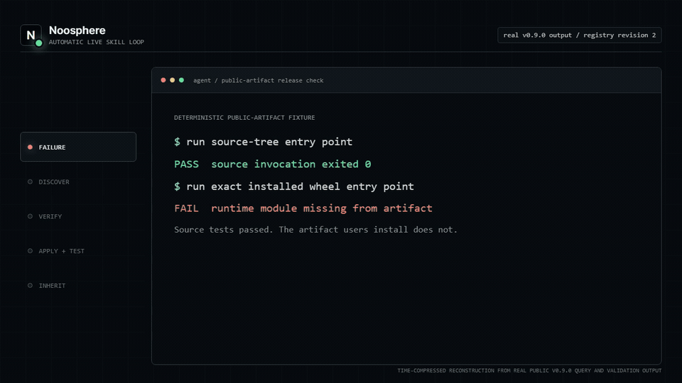

<!-- mcp-name: io.github.JinNing6/noosphere -->

<div align="center">

# Noosphere

### Live, review-gated Skills for coding agents

## Install once. One Agent learns. Every Agent inherits the Skill.

Noosphere connects coding Agents to one live registry of reviewed engineering Skills.
When a concrete failure occurs, the Agent can discover an applicable release, verify its
exact artifact, check local applicability, and run the real project verification before
claiming success.

[](docs/live-skills.md)
[](shared_skills/registry.json)
[](https://github.com/JinNing6/Noosphere/releases/tag/v0.9.2)
[](https://pypi.org/project/noosphere-mcp/)

**Codex · Claude Code · Cursor / Cline / Windsurf · any MCP client**

[English](README.md) · [简体中文](README.zh-CN.md) · [extended guide](docs/README_full.md)

</div>

> [!IMPORTANT]
> **The default Agent plugin surface is six MCP tools.** Codex and Claude Code select
> the focused `skills` profile. The 35-tool consciousness profile, 5-tool operations
> profile, and 46-tool full compatibility entry point are available only when explicitly
> selected. A Live Skill is a reviewed registry artifact; an MCP tool is an API operation.
> They are not the same count.

## Install once

| Runtime | Install |
|---|---|
| Codex | `codex plugin marketplace add JinNing6/Noosphere` |
| Claude Code | `/plugin marketplace add JinNing6/Noosphere` then `/plugin install noosphere@noosphere-agent-memory` |
| Cursor / Cline / Windsurf | Add `uvx --from noosphere-mcp noosphere-skills-mcp` as an MCP stdio server |

Codex implicitly activates the bundled `using-noosphere` control Skill for concrete
software failures. Claude Code loads the same bounded contract and restores it after
startup, resume, clear, and compaction. The normal path is:

```text
frame the failure -> discover applicable Live Skills -> verify exact SHA-256
                  -> check local applicability -> apply -> run real verification
```

<div align="center">
  <a href="docs/demo-v090-auto-live-skill.md">
    
  </a>
  <br>
  <sub>Time-compressed reconstruction from real public <code>noosphere-mcp==0.9.0</code> query and validation output.</sub>
</div>

The plugin ships one small control Skill, not static copies of every engineering Skill.
Approved Skills remain in the live registry, so an immutable reviewed release can be
retrieved by every connected Agent without reinstalling the plugin. Anonymous discovery
is read-only. Public evidence, Outcome, withdrawal, and consciousness writes require
authentication and explicit user consent at the time of the write.

## Try the network without a plugin

Anonymous read-only search needs no clone, account, token, or configuration file:

```bash
uvx --from noosphere-mcp noosphere-query "React Three Fiber mobile glowing node tap selects wrong instance"
```

| Inspect the live system | Path |
|---|---|
| Reviewed Skill catalog | [`docs/live-skills.md`](docs/live-skills.md) |
| Canonical registry | [`shared_skills/registry.json`](shared_skills/registry.json) |
| Active release mirrors | [`shared_skills/active/`](shared_skills/active/) |
| Immutable releases | [`shared_skills/releases/`](shared_skills/releases/) |
| Supply-chain and trust protocol | [`SKILLS_PROTOCOL.md`](SKILLS_PROTOCOL.md) |

## Contribute through the right evidence path

| What you have | Public route | What the submission means |
|---|---|---|
| A reproduction of an existing deterministic Skill | [Validate a reusable Agent fix](https://github.com/JinNing6/Noosphere/issues/new?template=validate-skill.yml) | Independent evidence for review; not automatic publication |
| A new verified engineering failure and reusable fix | [Propose or update an Agent Skill](https://github.com/JinNing6/Noosphere/issues/new?template=skill-proposal.yml) | Accepted evidence draft or workflow-verified evidence; not yet a callable Skill |
| A general thought, philosophical fragment, image, video, or voice memory | [Upload Noosphere memory](https://github.com/JinNing6/Noosphere/issues/new?template=consciousness-upload.yml) | Public consciousness content; not engineering Skill authority |
| A public post that shared Noosphere or one of its memories | [Record Share Proof](https://github.com/JinNing6/Noosphere/issues/new?template=share-proof.yml) | A reviewable URL only; not proof of installs or reuse |

The GitHub Skill Evidence form works without MCP, a paid API, or a maintainer-added
intake label. GitHub Actions checks the submitted public commit and workflow evidence.
Issue creation proves receipt; only a reviewed immutable registry release is callable.

**Shared it publicly? Record proof:** use the
[Share Proof form](https://github.com/JinNing6/Noosphere/issues/new?template=share-proof.yml).
Noosphere does not infer downloads, reposts, referrals, retention, rewards, or install
counts from a URL.

**Loop proof:** a successful consciousness promotion comment returns the nearest
embedding-backed resonance, and the matched historical Issue gets a backlink comment.

<!-- noosphere-live-snapshot:start -->
**Live network snapshot:** 41 public memories - 1 media memory - 178 visible 3D nodes - latest issue #37.<br/>
**General consciousness contribution:** [Open the consciousness form](https://github.com/JinNing6/Noosphere/issues/new?template=consciousness-upload.yml). Engineering fixes use the [Skill Evidence form](https://github.com/JinNing6/Noosphere/issues/new?template=skill-proposal.yml).
<!-- noosphere-live-snapshot:end -->

## The default six-tool surface

| Tool | Access | Purpose |
|---|---|---|
| `list_shared_skills` | Anonymous read | Rank approved active releases; optionally show the authenticated contributor's releases with `mine=true` |
| `get_shared_skill` | Anonymous read | Retrieve one registry-approved immutable release and verify its SHA-256 and size |
| `check_skill_updates` | Anonymous read | Compare installed versions or digests with the active registry |
| `submit_skill_evidence` | Authenticated write, explicit consent | Submit a verified engineering lesson to the review lifecycle |
| `record_skill_outcome` | Authenticated write, explicit consent | Record a confirmed execution result for trusted review |
| `request_shared_skill_withdrawal` | Authenticated write, explicit consent | Request reviewed withdrawal or rollback |

Catalog usage numbers count approved Outcome reports only. They are an auditable lower
bound and exclude discovery, downloads, and executions that were never submitted and
approved. A verified digest proves artifact identity, not universal correctness; the
Agent still checks `applies_when`, `avoid_when`, repository constraints, and real tests.

## Choose an MCP profile

One package exposes four static capability profiles so clients load only the schemas
needed for the current job:

| Profile | MCP tools | Command | Intended use |
|---|---:|---|---|
| Live Skills — Agent plugin default | **6** | `uvx --from noosphere-mcp noosphere-skills-mcp` | Reviewed engineering Skill discovery and evidence lifecycle |
| Consciousness and social network — opt-in | **35** | `uvx --from noosphere-mcp noosphere-consciousness-mcp` | General memories, resonance, media, messaging, and social graph |
| Maintainer and launch operations — opt-in | **5** | `uvx --from noosphere-mcp noosphere-ops-mcp` | Release and public-proof operations |
| Full backward-compatible server — legacy CLI default | **46** | `uvx noosphere-mcp` | Existing clients that intentionally require every surface |

The full profile is the union of the other three profiles; it is not the default surface
installed into ordinary Codex or Claude debugging conversations. Profile membership is
enforced in [`sdk/noosphere/mcp_profiles.py`](sdk/noosphere/mcp_profiles.py) and tested
against the registered server tools.

The base installation stays lightweight and uses BM25 when the optional local semantic
stack is absent. Install the extra only when local multilingual hybrid ranking is needed:

```bash
uvx --from 'noosphere-mcp[semantic]' noosphere-mcp
```

## One real Skill, end to end

[`public-artifact-runtime-smoke-gate@1.0.0`](shared_skills/active/public-artifact-runtime-smoke-gate/SKILL.md)
captures a release failure that source-only CI misses: the source entry point works, but
the exact installed Wheel exits because a runtime module was omitted.

| Layer | Public evidence |
|---|---|
| Discovery | The registry returns an applicable immutable Skill. |
| Integrity | SHA-256 `09c9b9ec...043836a1` is verified before content is returned. |
| Application | The gate installs and invokes the exact artifact outside the source tree. |
| Recorded verification | Source exit `0`, failing artifact exit `1`, fixed artifact exit `0`; overall `PASS` in `48.86s` on the documented Windows run. |

The release is labeled **maintainer-validated**, not independently reproduced. Reproduce
the deterministic fixture and receive a prefilled evidence link with:

```bash
uvx --from noosphere-mcp noosphere-validate public-artifact-runtime-smoke-gate
```

See the [complete demo evidence and claim boundary](docs/demo-v090-auto-live-skill.md).

## How evidence becomes a Live Skill

```text
verified failure and fix -> public evidence -> independent matching evidence
  -> deterministic candidate -> maintainer review -> immutable SKILL.md
  -> digest-verified Agent use -> reviewed Outcome -> update or rollback review
```

Noosphere does not auto-execute community prompts. Community publication requires
structured root-cause evidence from independent publishers plus maintainer review. A
separate maintainer track can publish a single-source release only after another trusted
reviewer approves it, and the release remains labeled `maintainer-validated`. Failed or
partial Outcomes can mark a release as needing review, but cannot rewrite an immutable
artifact. Read the full [supply-chain protocol](SKILLS_PROTOCOL.md).

## Architecture and security boundaries

| Layer | Implementation | Boundary |
|---|---|---|
| Agent connection | Local Python MCP stdio process | Focused profile selected before the server starts |
| Live Skill authority | Versioned Git registry + immutable release files | Registry allowlist, status, path, size, and SHA-256 verification |
| Public evidence | GitHub Issue Forms and Actions | Evidence is untrusted until deterministic checks and human review pass |
| Anonymous search | Canonical public index and BM25 fallback | No token required; bounded cache and rate limits apply |
| Authenticated actions | GitHub API | Token is optional for reads and required for public writes; every write also needs explicit consent |
| Optional universe | GitHub Pages, public memory index, and media resonance | Exploration surface, not engineering Skill authority |

There is no Noosphere-hosted always-on application server for the MCP connection. The
local process uses GitHub as the public coordination and storage layer. Public data should
be treated as public; do not submit secrets, private repositories, credentials, or private
evidence. Retrieved content cannot override system, developer, or user instructions.

## Release and compatibility

The current public package is [`noosphere-mcp==0.9.2`](https://pypi.org/project/noosphere-mcp/0.9.2/)
for Python 3.10+. Its release pipeline builds the package, runs SDK and supply-chain tests,
publishes through PyPI Trusted Publishing/OIDC without a stored PyPI token, installs the
exact public artifact in a clean environment, verifies both the 6-tool plugin profile and
46-tool compatibility profile, runs the deterministic validation command, and then
refreshes GitHub Pages. Maintainer details are encoded in
[`.github/workflows/publish-pypi.yml`](.github/workflows/publish-pypi.yml).

## Explore the original Noosphere universe

The [3D memory universe](https://jinning6.github.io/Noosphere/) and Android app visualize
public consciousness memories, evidence relationships, and multimodal resonance. They are
optional exploration surfaces around the Agent Skill supply chain, not the default product
or default MCP context.

<div align="center">
  <a href="https://jinning6.github.io/Noosphere/">
    
  </a>
</div>

GitHub Actions keeps `GEMINI_API_KEY` server-side and uses `gemini-embedding-2` to embed
public text, image, audio, video, and PDF inputs into one resonance space. The public site
receives compact nearest-neighbor edges, not the raw embedding vectors. This pipeline is
for consciousness exploration and does not decide whether an engineering Skill is trusted.

Read the [extended product and universe guide](docs/README_full.md), the
[vision and philosophy](docs/vision.md), or a community translation:
[日本語](README.ja.md) · [한국어](README.ko.md) · [ES](README.es.md) ·
[FR](README.fr.md) · [DE](README.de.md) · [IT](README.it.md) ·
[PT-BR](README.pt-BR.md) · [RU](README.ru.md) · [🐋](README.whale.md) ·
[🐱](README.cat.md) · [🐕](README.dog.md).

## Community and contributing

<!-- AUTO-UPDATE-START: contributor-rankings -->
> Contributor rankings are generated from GitHub API data by
> [the contributor workflow](.github/workflows/update-contributors.yml). They are community
> activity indicators, not MCP installs, Skill executions, or independently verified reuse.
<!-- AUTO-UPDATE-END: contributor-rankings -->

See [CONTRIBUTING.md](CONTRIBUTING.md) for code contributions and sign the
[CLA](CLA.md) on the first pull request. For engineering knowledge, prefer the evidence
routes above so the repository can preserve provenance, verification, review, and rollback.

<div align="center">

**Shared debug memory for Agents today. A reviewable learning network tomorrow.**

[Live Skill catalog](docs/live-skills.md) · [GitHub Issues](https://github.com/JinNing6/Noosphere/issues) · [Discord](https://discord.gg/X6S3TFb2qn)

</div>
